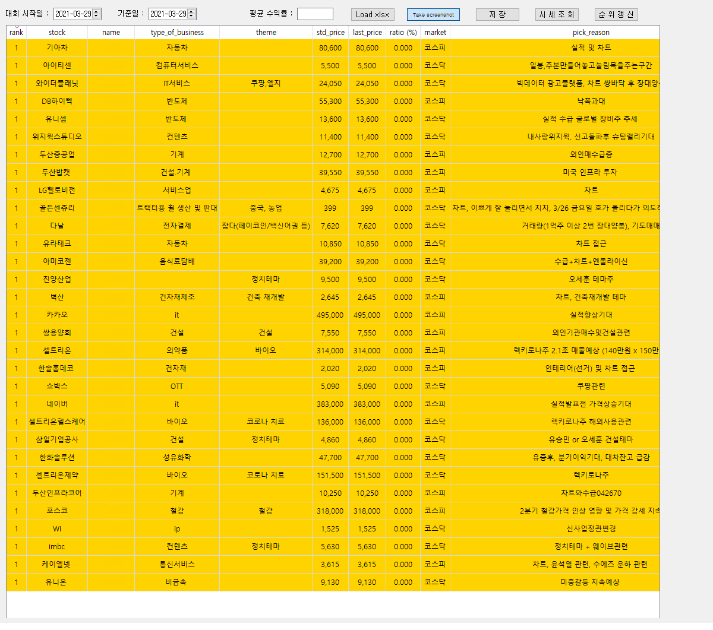

# Training_Competition
> Pyqt5 GUI app to show stock competition rankings

## Requirements;
> Python 3.5 or greater,
> PyQt5,
> bs4

## How to Use

1. Prepare Base Excel File for Initialization and Excute.

               
2. Load Excel for Initialization.   

3. Quote Inquiry 

4. Ranking Update once a day (When stock market is closed)

5. Save Daily Result to JSON 

## Update History

* 0.1.0
    * First Release

## Contributing

Contributions are what make the open source community such an amazing place to be learn, inspire, and create. Any contributions you make are greatly appreciated.

Fork the Project
Create your Feature Branch (git checkout -b feature/Trading_Competition)
Commit your Changes (git commit -m 'Add some Trading_Competition')
Push to the Branch (git push origin feature/Trading_Competition)
Open a Pull Request

<!-- LICENSE -->
## License

Distributed under the GNU General Public License v3.0. See `LICENSE` for more information.

<!-- CONTACT -->
## Contact

SecuredEevee - forlove@snu.ac.kr

Project Link: [https://github.com/SecuredEevee/Trading_Competition](https://github.com/SecuredEevee/Trading_Competition)
<!-- Markdown link & img dfn's -->
[npm-image]: https://img.shields.io/npm/v/datadog-metrics.svg?style=flat-square
[npm-url]: https://npmjs.org/package/datadog-metrics
[npm-downloads]: https://img.shields.io/npm/dm/datadog-metrics.svg?style=flat-square
[travis-image]: https://img.shields.io/travis/dbader/node-datadog-metrics/master.svg?style=flat-square
[travis-url]: https://travis-ci.org/dbader/node-datadog-metrics
[wiki]: https://github.com/yourname/yourproject/wiki
